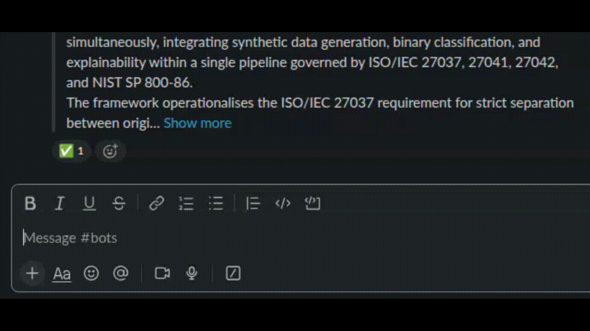

# Slacktero

A Slack bot that files links into a Zotero group library and tags them by emoji reaction.



## What it does

Slacktero files a link three ways:

1. **@mention** it with a link (any link)
2. **DM** it a link (any link)
3. **post** a link from a watched domain in a channel it's in (no mention needed)

It reacts to say what happened:

- ✅ filed, with metadata
- ⚠️ filed, but no metadata could be found
- ❌ could not be filed at all

Then it adds one emoji per configured tag. React with one and the paper is tagged
and filed into every project using that tag; remove the reaction to undo it.
Papers matching no project stay in Unfiled.

Metadata comes from Zotero's translation-server, running locally. Duplicates are
caught by DOI and URL across the whole library, including items already in collections.

### Commands

| | |
|---|---|
| `@Slacktero <link>` | file a link |
| `@Slacktero tags` | what each emoji tags a paper with |
| `@Slacktero file [n]` | list the n newest unfiled papers to tag (default 5, max 10) |
| `@Slacktero help` | command list |

## Configure

`slacktero.toml`:

```toml
domains = ["arxiv.org", "ieee.org"]

[tags]
"rca" = "mag"
"sec:offense" = "crossed_swords"

[projects]
"Dissect" = ["rca", "sec:offense"]
```

- `domains` — filed automatically without a mention. Subdomains match.
- `[tags]` — tag name to the emoji that applies it.
- `[projects]` — Zotero collection name to the tags that file into it. Missing
  collections are created at the top level.

Every tag used in `[projects]` must exist in `[tags]`, and no two tags may share an
emoji; either raises at startup. Edit, then `docker compose restart bot`.

## Install

**1. Slack app** (Socket Mode) at <https://api.slack.com/apps> → Create New App:

- **Socket Mode** → enable → App-Level Token (`xapp-…`) → `SLACK_APP_TOKEN`
- **OAuth & Permissions** → Bot Token Scopes: `app_mentions:read`, `chat:write`,
  `reactions:read`, `reactions:write`, `channels:history`, `groups:history`,
  `im:history` → Install → Bot Token (`xoxb-…`) → `SLACK_BOT_TOKEN`
- **Event Subscriptions** → bot events: `app_mention`, `message.channels`,
  `message.groups`, `message.im`, `reaction_added`, `reaction_removed`
- `/invite` it into the channels it should watch

Changing scopes later requires reinstalling the app.

**2. Zotero** at <https://www.zotero.org/settings/keys>:

- An API key with **write** access to the group → `ZOTERO_API_KEY`
- The group's **numeric** ID → `ZOTERO_GROUP_ID`

**3. Run** (needs Docker Engine + Compose v2):

```bash
cp .env.example .env      # fill in the four values above
docker compose up --build
```

The first build compiles the translation-server from source. Set `LOG_LEVEL=DEBUG`
in `.env` for a per-add trace.

## Layout

```
main.py             entry point
slacktero.toml      domains, tags, projects
docker/             bot + translation-server images
bot/app.py          wire handlers, route Slack events
bot/config.py       env + slacktero.toml, validated at startup
bot/handlers.py     slice messages, run the pipeline, react
bot/translator.py   URL → metadata via the translation-server
bot/filer.py        dedup against an indexed copy of the library, then write
```

## Used by

[](https://www.cylab.cmu.edu/research/cyber-autonomy-initiative/index.html)
